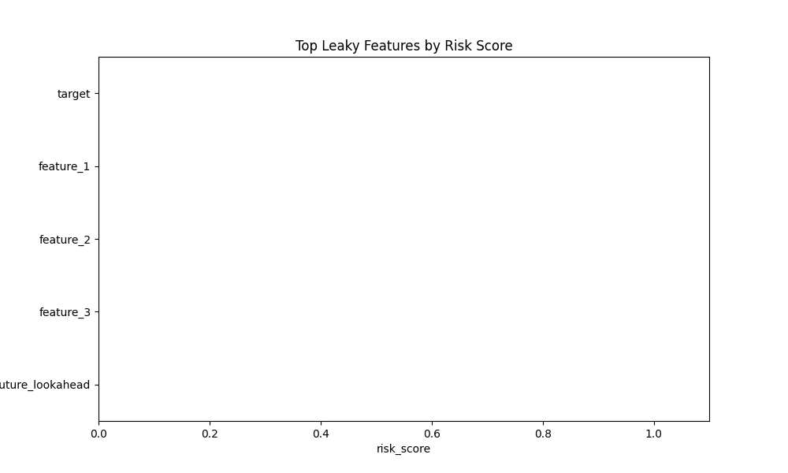

# Automated Data Leakage Audit Report

## 1. Executive Summary
✅ No critical leakage detected.

## 2. High Risk Features
| feature                        |   risk_score |   train_correlation |   drift_p_value |       psi | reasons   |
|:-------------------------------|-------------:|--------------------:|----------------:|----------:|:----------|
| target                         |            0 |            0.798229 |        0.965735 | 0.0535857 |           |
| feature_1                      |            0 |            0.692718 |        0.440902 | 0.08643   |           |
| feature_2                      |            0 |            0.337626 |        0.527365 | 0.110342  |           |
| feature_3                      |            0 |           -0.017151 |        0.867126 | 0.0322466 |           |
| leaky_feature_future_lookahead |            0 |            0.015046 |        0.440902 | 0.0863781 |           |

## 3. Model Validation Impact
- **Baseline Model (All Features)**: AUC = N/A, Accuracy = N/A
- **Sanitized Model (Cleaned)**: AUC = N/A, Accuracy = N/A

Performance remained stable after removing flagged features. The leakage might be minor or redundant.

## 4. Visualizations
See `figures/` directory for detailed plots.

